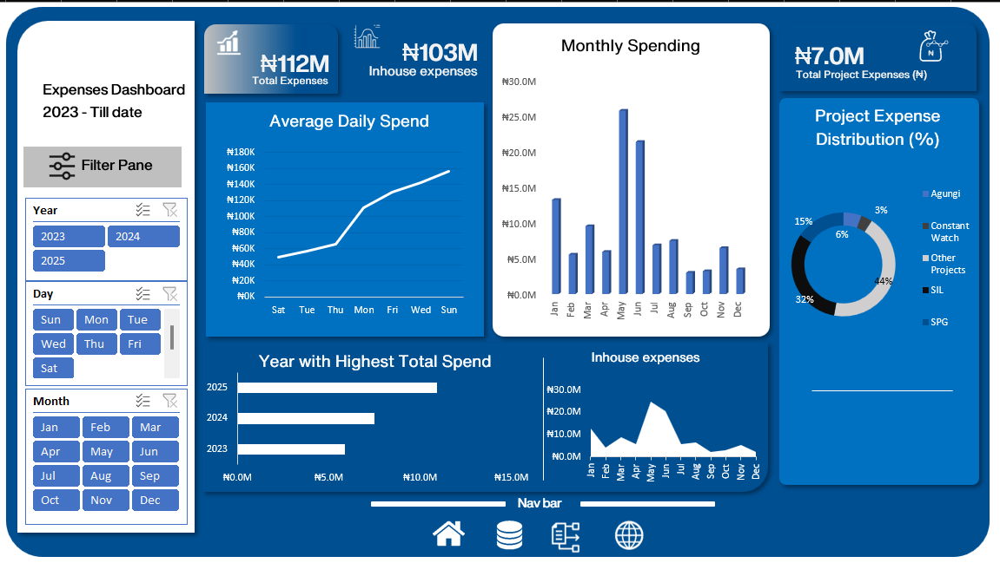

# Business Consulting Firm Expenses Dashboard (2023 - 2025)

## 📌 Project Overview
The **Expenses Dashboard** was developed to track and analyze the expenses of a business consulting firm from **2023 to 2025**.  
It provides a comprehensive view of in-house expenses and project-related costs across multiple projects, enabling management to make data-driven financial decisions.

---

## 📊 Data Source & Description
- **Dataset Size:** 1,090 expense records  
- **Source:** Company’s financial records (37 Excel files consolidated)  
- **Variables Included:**
  - Date  
  - Day  
  - Month  
  - Year  
  - Description  
  - In-house expenses  
  - Project A expenses  
  - Project B expenses  
  - Project C expenses  
  - Project D expenses  
  - Other projects  
  - **Total expenses**  

---

## 🎯 Objectives
1. Track the company’s total annual expenses.  
2. Identify spending trends across time (daily, monthly, yearly).  
3. Compare in-house vs project expenses.  
4. Understand which projects account for the largest share of costs.  
5. Provide insights for better financial planning and control.  

---

## 🛠️ Tools Used
- **Microsoft Excel**
  - **Power Query** → Data cleaning, consolidation, and transformation  
  - **DAX (Data Analysis Expressions)** → Advanced calculations and KPIs  
  - **Excel Dashboarding** → Interactive visuals  

---

## 🧹 Data Preparation & Cleaning
Steps taken during preparation:
1. **Data Consolidation**  
   - Combined 37 separate Excel files into one structured dataset.  
2. **Data Cleaning**  
   - Removed duplicates and irrelevant columns.  
   - Handled missing/blank values in expenses.  
3. **Feature Engineering**  
   - Extracted Day, Month, and Year from Date.  
   - Created a **Total** column to capture overall spending per record.  
4. **Integration in Excel**  
   - Used **Power Query** for data shaping.  
   - Applied **DAX** for measures and calculations.  

---

## 📈 Key Findings & Insights
From the dashboard (2023–2025):  
- **Total Expenses:** ₦112M  
- **In-house Expenses:** ₦103M (majority of spending)  
- **Project Expenses:** ₦7M distributed across 5 projects.  
- **Expense Distribution:**  
  - Project A → 44%  
  - Project B → 32%  
  - Project D → 15%  
  - Project C → 6%  
  - Others → 3%  
- **Highest Annual Spend:** Recorded in **2025**.  
- **Peak Monthly Spending:** May, followed by June and March.  
- **Average Daily Spend:** Increased steadily through the week, peaking on Fridays.  

---

## 💡 Recommendations
- Closely monitor **in-house expenses** as they account for ~92% of total spending.  
- Investigate **May’s spike in expenses** to identify root causes and prevent overspending.  
- Evaluate **project allocation**, especially Project A and Project B, which consume ~76% of project expenses.  
- Implement stricter cost-control measures during high-spending periods.  

---

## 📌 Conclusion
The dashboard provides a clear overview of company spending trends, highlighting areas where costs can be better managed.  
By leveraging **Excel, Power Query, and DAX**, the project transformed raw, scattered data into actionable insights that support smarter financial decisions.  

---

## 📸 Dashboard Preview

